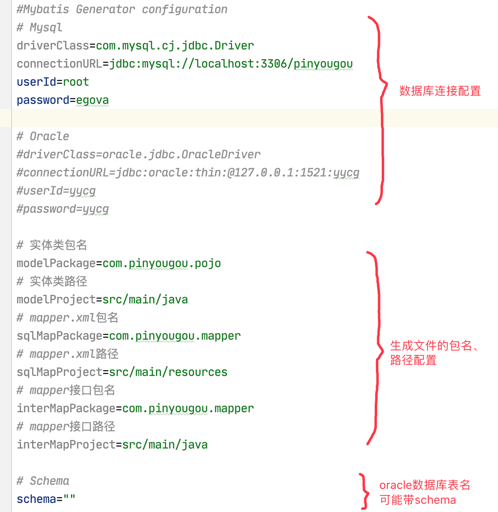
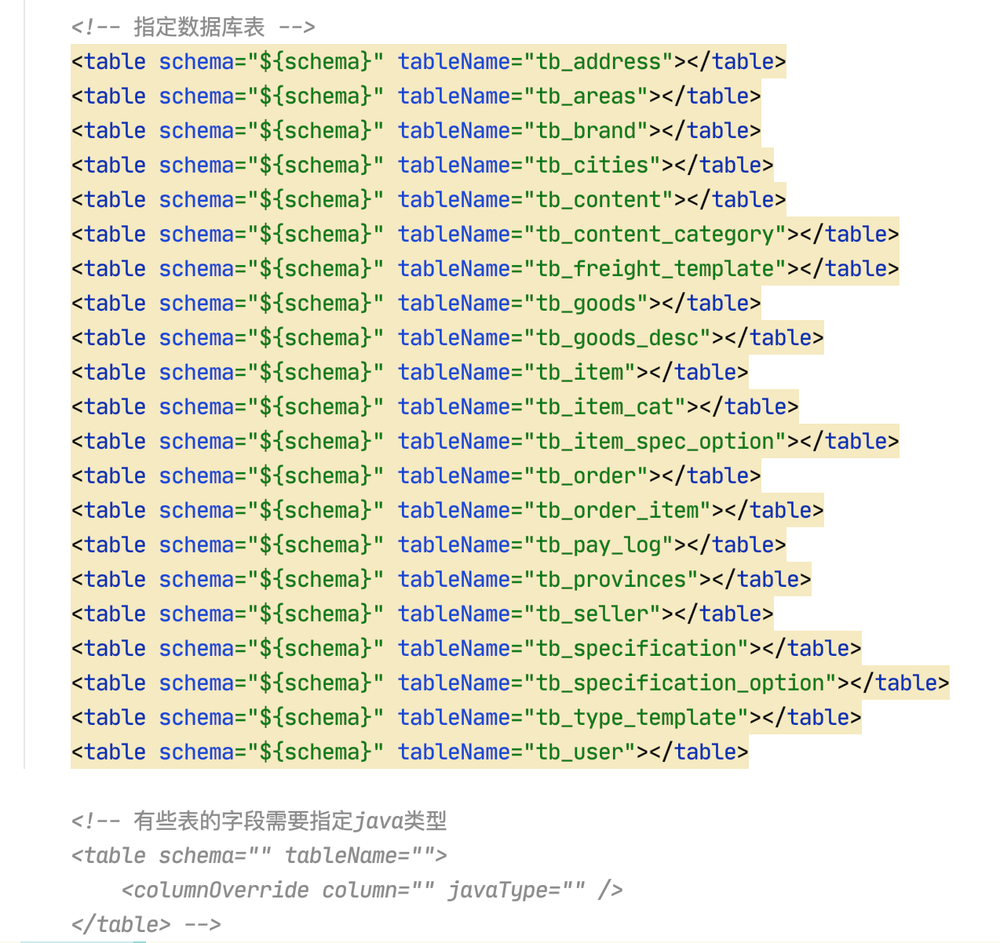

# Mybatis逆向工程使用说明

### 第一步：基础配置

**配置文件：src/main/resources/config/init.properties**

配置内容：数据库连接的配置；实体类、mapper.xml文件、mapper接口文件的包名、路径等的配置。

### 第二步：数据表配置

**配置文件：src/main/resources/config/generatorConfig.xml**

配置内容：需要逆向生成实体类、mapper.xml、mapper接口的数据表名称

### 第三步：执行生成方法

执行GeneratorSqlmap.java的main方法即可自动生成所有的实体类、mapper.xml、mapper接口等文件。